<div align="center">




# cshutdown

**Your computer doesn't turn off. It flatlines.**<br>
A cyberpunk style system crash in your terminal, nine seconds long, then `shutdown -h now`. Any key aborts.

<a href="#jack-in"></a>


<a href="https://omarchy.org"></a>

<kbd>[jack in](#jack-in)</kbd>&nbsp;
<kbd>[the sequence](#the-sequence)</kbd>&nbsp;
<kbd>[abort](#abort)</kbd>&nbsp;
<kbd>[faq](#faq)</kbd>

</div>

```diff
- [ERR] RELIC.BIOCHIP: engram integrity 37.2% - DEGRADING
- [ERR] NETWATCH: BLACKWALL breach in sector 0xDEAD
+ [SYS] syncing filesystems ... done
+ [SYS] reached target Power-Off
- [ERR] >>> FLATLINE <<<
```

`cshutdown` is a shutdown command that plays a full-screen system crash before it powers the machine off. A syslog kills your real processes by name, a breach protocol uploads its daemons, the title tears itself apart in red and cyan, the heart monitor races and then flatlines, and the screen melts and collapses like an old CRT. It is one Python file, standard library only, drawn in truecolor at 60 frames a second, and built for [Omarchy](https://omarchy.org) (or whatever sub-optimal unix-like system you're running).


## Jack in

```sh
curl -fsSL https://raw.githubusercontent.com/uxeric/cshutdown/HEAD/install.sh | bash
```

It installs `cshutdown` into `~/.local/bin`, no root needed. Run the same line again to update.

On Omarchy it also wires itself in:

| Where | What you get |
|---|---|
| System menu, <kbd>Super</kbd>+<kbd>Escape</kbd> | **󰚌 Cyber Shutdown**, right under Shutdown |
| App launcher, <kbd>Super</kbd>+<kbd>Alt</kbd>+<kbd>Space</kbd> | **Cyber Shutdown**, with its own icon |

Both open a terminal that goes fullscreen before the crash starts. Try it first without the shutdown:

```sh
cshutdown --dry-run
```


## The sequence

| T+ | Phase | On screen |
|---|---|---|
| `0.0s` | **Crash** | Static, then `WARNING` over flashing hazard stripes |
| `0.8s` | **HUD** | The syslog sends SIGTERM to your processes by name and PID, the breach protocol picks its codes and uploads daemons, `SYSTEM FAILURE` glitches harder every second, the heart monitor races to 200 bpm and fades |
| `6.8s` | **Meltdown** | Columns drip down the screen, everything bleeds red, `FLATLINE` |
| `8.2s` | **Power-off** | The picture squashes into a white line, then a dot, then `// SIGNAL LOST` |
| `9.0s` | **Shutdown** | `shutdown -h now` |

The layout fits the terminal. A fullscreen window gets the two-line title, the breach protocol and the memory dump. On an 80x24 terminal you still get the title, the countdown and the progress bar.

## Abort


Any key aborts, at any point before the end, including <kbd>Ctrl</kbd>+<kbd>C</kbd>, <kbd>Ctrl</kbd>+<kbd>Z</kbd> and <kbd>Esc</kbd>. So does closing the window, a `SIGTERM`, or a suspend and resume. The machine shuts down only when the whole sequence plays out with no key pressed, and `cshutdown` refuses to start at all if it isn't in a terminal, because nothing could stop it there.

## Usage

```sh
cshutdown                 # the real thing
cshutdown --dry-run       # the whole show, then prints the command instead of running it
cshutdown --duration 6    # 3 to 9.9 seconds, default 9
cshutdown --fullscreen    # make this terminal window fullscreen first (Hyprland)
```

| Exit | Means |
|---|---|
| `0` | shutdown issued, or the dry run finished |
| `1` | aborted |
| `2` | not run in a terminal |


## FAQ

> [!CAUTION]
> **Does it flash?**<br>
> Yes, a lot. It has rapid red flashes, inverted bands and strobing glitches for the full nine seconds. If flashing lights are a problem for you, skip this one.

> [!IMPORTANT]
> **Will it shut down by accident?**<br>
> Not unless you sit through all nine seconds without touching anything. Every key aborts, and so does every way of closing the window.

> [!NOTE]
> **Does it really kill my processes by name?**<br>
> It reads their names from `/proc` for the syslog. The killing is done afterwards by `shutdown`, same as always.

> [!TIP]
> **Can I make it longer?**<br>
> No. It's capped under ten seconds. You have places to be, choom.

<div align="center">
<br>


<sub><code>// SIGNAL LOST</code></sub>

</div>
